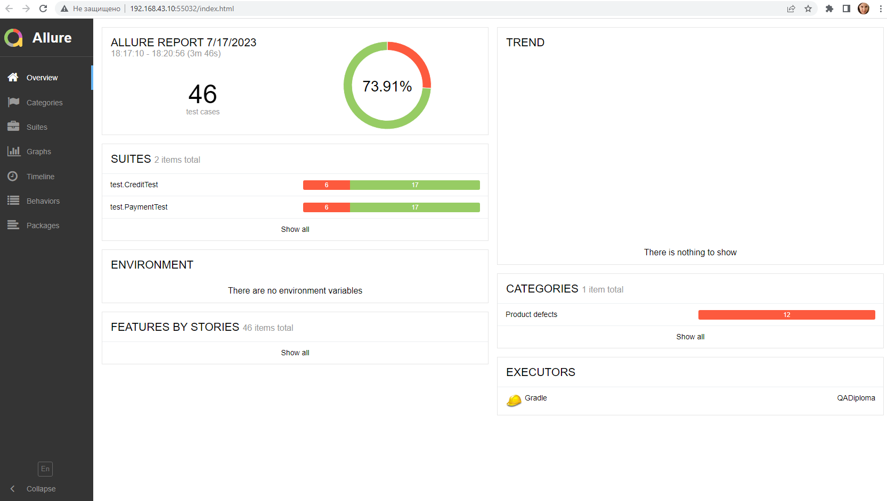
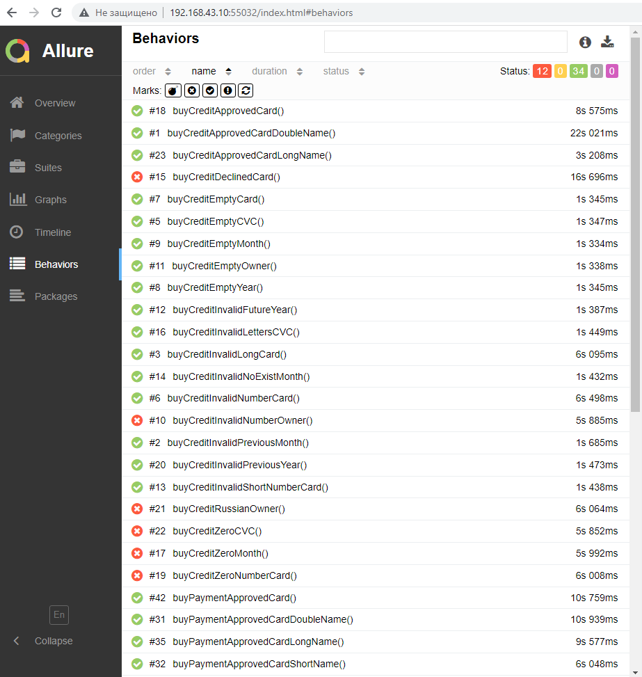

**Отчет по итогам тестирования**

*Краткое описание*

Было проведено тестирование приложения — веб-сервиса, который предлагает купить тур по определённой цене двумя способами:
1. Обычная оплата по дебетовой карте.
2. Уникальная технология: выдача кредита по данным банковской карты.
Тестирование проведено для двух баз данных: MySQL и PostgreSQL.
Реализовано автоматизирование позитивных и негативных сценариев покупки тура.

*Количество тест-кейсов*

Для тестирования двух СУБД проведено 46 тестов: 34 успешных и 12 неуспешных.

*Отчеты Allure*

*Общие рекомендации*

Необходима разработка документации по работе приложения, а также устранение недостатков, указанных в баг-репортах.
Кроме того, стоит обратить внимание на уведомления, которые появляются под полями формы при некорректном их заполнении: требования к заполенению каждого поля должны быть указаны максимально четко и понятно для пользователя. Например, для поля "CVC/CVV" вместо "Неверный формат" указывать. что поле может быть заполнено только арабскими цифрами.